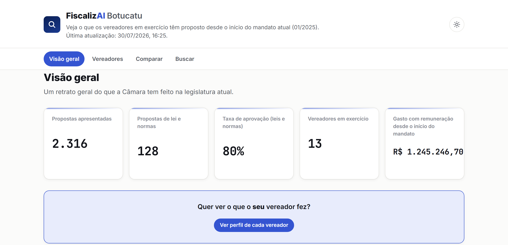
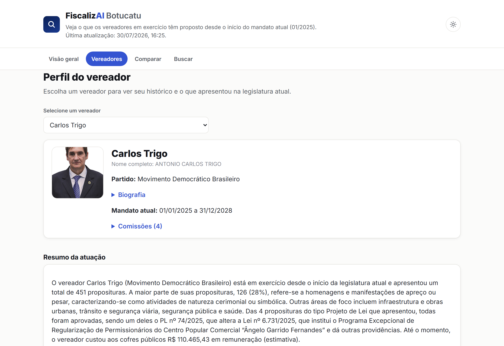

# FiscalizAI Botucatu

**Pipeline de dados + IA para fiscalizar a atuação da Câmara Municipal de Botucatu — do
scraping à produção.**

🔗 **[Acesse o site ao vivo](https://thalesh7991.github.io/scraping_prefeitura/)**

`Python` · `SQLite` · `Playwright` · `Google Gemini API` · `GitHub Actions (CI/CD)` · `GitHub Pages`



## O problema

O site oficial da Câmara Municipal disponibiliza, publicamente, todo o histórico de propostas de
cada vereador — mas de um jeito pensado para *arquivar documentos*, não para *informar cidadãos*.
Descobrir o que um vereador específico andou fazendo exige navegar um sistema de busca avançada,
entender uma taxonomia de tipos formais (Projeto de Lei, Requerimento, Indicação, Moção...) e,
mesmo assim, não sobra claro **o que cada proposta significa de fato**: um "Projeto de Lei" tanto
pode criar uma política pública quanto só dar nome a uma rua.

O FiscalizAI resolve isso automatizando a coleta e reclassificando cada proposta pelo **assunto
real do texto**, não pela categoria formal - e publica o resultado num site público, atualizado
todos os dias, sem depender de ninguém pedir ou perguntar nada à Câmara.

## O que a ferramenta faz

- **Perfil individual de cada vereador**: todas as propostas apresentadas, remuneração
  (valor atual e estimativa acumulada desde o início do mandato) e um resumo em texto gerado por
  IA sobre a atuação.
- **Classificação honesta por assunto**: 14 categorias calculadas por regra determinística sobre o
  texto da ementa - as cerimoniais/simbólicas (denominação de rua, data comemorativa, utilidade
  pública, homenagens) aparecem nomeadas ao lado das de política pública real, nunca escondidas
  atrás de uma média.
- **Comparação entre vereadores** por tipo de atuação, e **busca textual** com filtros em todas as
  proposituras já coletadas.
- **Gasto com remuneração**: coletado do portal de transparência da Prefeitura e cruzado com o
  histórico de mandato de cada vereador (titular licenciado x suplente que assumiu).

## Principais achados

A motivação inicial era simples - "os vereadores não estão fazendo só coisa inútil?" - então a
primeira coisa que o projeto precisou responder foi: **o que, de fato, a Câmara produz?**
Validado contra as 7.234 proposituras já coletadas (2021–2026):

| Achado | Número |
|---|---|
| Do total de proposituras, são cerimoniais/simbólicas (sem efeito de lei) | **17%** |
| Dos **Projetos de Lei** especificamente - o tipo que soa mais "sério" | **68% são cerimoniais** (denominação de rua, utilidade pública, data comemorativa) |
| Dos **Requerimentos** - o tipo que soa mais burocrático | **apenas 9%** são cerimoniais; o resto é fiscalização e pedido real ao Executivo |

O achado central: **o tipo formal de uma proposta não prevê a substância dela** — "Projeto de Lei",
o tipo mais associado a produção legislativa séria, é justamente o mais inflado por conteúdo
simbólico. Só dava pra descobrir isso classificando pelo conteúdo real de cada ementa, não pelo
rótulo burocrático.

## Como funciona

```
Site oficial da Câmara (Siscam)  ─┐
Portal de transparência (Fiorilli)─┼─▶  scraper (requests/Playwright)  ─▶  SQLite
                                   ┘                                         │
                                                                             ▼
                                                      classificação por regra (assunto,
                                                      cerimonial x substantivo, situação)
                                                                             │
                                                                             ▼
                                                 export_json.py  ─▶  site/data/*.json
                                                                             │
                                                                             ▼
                                                        site estático (HTML/CSS/JS + Chart.js)
                                                                             │
                                                                             ▼
                                                       GitHub Actions (diário) ─▶ GitHub Pages
```

O projeto nasceu de notebooks exploratórios (`notebooks/Ciclo1..5.ipynb`, mantidos no repositório
como histórico) contra uma versão antiga do site da Câmara, hoje fora do ar. Depois de o site
oficial mudar de sistema, o pipeline foi reconstruído do zero: scraper via GET estruturado (sem
necessidade de navegador headless para a maior parte da coleta), banco SQLite com upserts
idempotentes, e um site público estático publicado via CI/CD - sem servidor, sem custo de
infraestrutura.

### Decisões de engenharia

**Regra determinística para classificar, IA só para narrar.** Cada proposta é classificada em uma
de 14 categorias por regex sobre o texto da ementa - nunca por um modelo de linguagem. Isso importa
porque a classificação sustenta uma alegação pública sobre o trabalho de uma pessoa real: precisa
ser auditável ("bateu exatamente este trecho do texto"), não "a IA decidiu assim". A API do Gemini
entra só depois, para transformar os números já calculados em um parágrafo legível por vereador -
nunca para decidir o que é ou não relevante.

**O resumo por IA roda offline, fora do pipeline diário.** Gerar o resumo custa uma chamada de API
por vereador; os dados que o alimentam não mudam todo dia. Em vez de pagar esse custo (e correr o
risco de uma falha de API derrubar o deploy) a cada execução, um script separado
(`src/gerar_resumos.py`) roda sob demanda, cacheia por hash dos dados de entrada, e grava o
resultado num arquivo versionado no git. O pipeline diário só *lê* esse arquivo.

**Engenharia reversa de um portal de terceiros sem API.** Os dados de remuneração vêm de um
portal de transparência (DevExpress/ASP.NET WebForms) sem API pública, que só carrega dados via
callback JavaScript e exige controles client-side específicos para navegar entre meses. Depois de
confirmar (por 7 abordagens distintas) que trocar o ano de exercício trava o portal de forma
irrecuperável — um bug real do lado deles, não algo corrigível no cliente —, o scraper foi
desenhado para coletar de forma confiável só o intervalo comprovadamente estável, documentando a
limitação em vez de escondê-la.

## Stack técnica

| Camada | Tecnologia |
|---|---|
| Coleta | `requests` + `BeautifulSoup` (Siscam), `Playwright` (portal de transparência) |
| Persistência | `SQLite` |
| Classificação/análise | `Python` (regex determinístico) |
| Resumo em linguagem natural | `Google Gemini API` |
| Front-end | HTML/CSS/JS estático + `Chart.js` (sem framework) |
| CI/CD | `GitHub Actions` (scraping + build diário) |
| Publicação | `GitHub Pages` |

## Como rodar localmente

```bash
pip install -r requirements.txt

# Cria o banco (idempotente)
python setup_database.py

# Coleta completa (vereadores + proposituras)
python -m src.main --mode full

# Remuneração (portal de transparência - requer Playwright)
python -m src.scraper_transparencia

# Exporta o recorte da legislatura atual para site/data/*.json
python -m src.export_json

# Resumo por IA (opcional - requer GEMINI_API_KEY em .env)
python -m src.gerar_resumos

# Site estático local
cd site && python -m http.server 8080   # depois abra http://localhost:8080/index.html
```

O banco (`data/camara_botucatu.db`) e o JSON exportado (`site/data/*.json`) não são versionados -
são gerados localmente pelos comandos acima, ou automaticamente pelo workflow de deploy.

## Estrutura do projeto

```
src/
├── config.py                  # Taxonomia de tipos/famílias e das 14 categorias de assunto
├── database.py                 # Schema e acesso ao SQLite
├── scraper_vereadores.py       # Vereadores + perfil (bio, legislaturas, comissões)
├── scraper_proposituras.py     # Busca paginada de proposituras (Siscam)
├── scraper_transparencia.py    # Remuneração via portal de transparência (Playwright)
├── export_json.py              # Classificação + exportação para site/data/*.json
├── gerar_resumos.py            # Resumo por IA (offline, versionado em resumos_atuacao.json)
└── main.py                     # CLI orquestrador do scraper
site/                           # Site público estático
├── index.html / vereador.html / comparar.html / buscar.html
├── assets/{style.css,data.js,layout.js,charts.js}
└── data/*.json                 # Gerado por export_json.py - não versionado
.github/workflows/
├── deploy-site.yml             # Scraper + export_json + publica no GitHub Pages (diário)
└── scrape.yml                  # Validação sob demanda do scraper contra o site oficial
```

## Screenshot: perfil do vereador



---

Projeto pessoal e independente, sem vínculo com a Câmara Municipal ou a Prefeitura de Botucatu.
Todos os dados são públicos e coletados diretamente do site oficial da Câmara.
